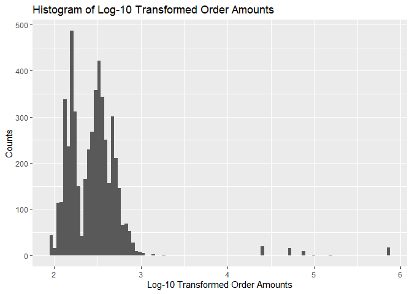
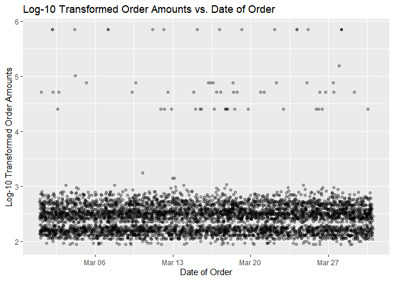

# Summer 2022 Data Science Intern Challenge

## Introduction

### Dependencies

To run the code blocks included in this README, the only depdencies required are R v4.0.5 and its associated package `tidyverse` v1.3.1.

On the other hand, generating the PDF and an early draft of this README will require the `rmarkdown` package and a LaTeX installation.

### Motivations and Tooling

I choose R as my analysis tool, since the `tidyverse` packages provide a
clean and uniform set of libraries/interfaces for simple data wrangling
and visualization. I find R’s data visualization package `ggplot2` to be
easier to use with better out-of-the-box defaults than Python3’s
`Matplotlib` and `Seaborn`, and since I have to write a report,
RMarkdown provides a nice integrated way to present my thought process,
findings, figures, code, and results. RMarkdown and some manual changes were used to produce this README.

I summarize the answers to the questions in the section, and then detail
the analysis and interpretation in the section.

## Summary

### Question 1: Average Order Value (AOV) for 100 Sneaker Shops

**(a) Think about what could be going wrong with our calculation. Think about a better way to evaluate this data.** The dataset is skewed right and the extreme outliers exhibits a strong influence on the means, shifting the mean much higher.

**(b) What metric would you report for this dataset?** The median is more robust, behaving much better in the presence of extreme outliers.

**(c) What is its value?** The median of the `order_amount`, computed on all the data, is 284.

### Question 2: SQL Database of Customers

**(a) How many orders were shipped by Speedy Express in total?** **(b) What is the last name of the employee with the most orders?** In total, 54 orders were shipped by Speedy Express.

**(b) What is the last name of the employee with the most orders?** “Peacock” is the last name of the employee associated with the most
orders.

**(c) What product was ordered the most by customers in Germany?** The name of the product with most quantities ordered by customers in
Germany is “Boston Crab Meat”, and its ProductID is 40.


## Analysis and Code

### Question 1

#### 1(a). Think about what could be going wrong with our calculation. Think about a better way to evaluate this data.

Before I even load in the data, I look over the spreadsheet in Google
Sheets to see if I can spot any anomalous data points. There are several
points of concern, as I notice several orders with an `order_amount`
(also referred to as order value) of 704000, whereas most orders have an
`order_amount` in the hundreds. Depending on how large and skewed the
dataset is, this can result in a much higher than expected average order
value (AOV): for example, some customers may buy much of the stock in a
few bulk orders– perhaps 90% of the inventory over a dozen orders. If
the remaining 10% of inventory is sold over several thousand orders,
then this will result in a less than meaningful AOV since means are
sensitive to outlier data points. At least– this is my non-rigorous,
initial hypothesis.

To test my intuitions, I will load in the data, try to reproduce the
given AOV, calculate some summary statistics, and present a histogram of
the `order_amount`.

``` r
library(tidyverse)  # loads dependencies
```

``` r
# Load in the data 
orders.data <- read_csv(
  file = "./data/2019winter-challenge-shopify.csv", 
  col_names = TRUE,
  col_types = cols(
    order_id = col_integer(),
    shop_id = col_integer(),
    user_id = col_integer(),
    order_amount = col_integer(),
    total_items = col_integer(),
    payment_method = col_character(),
    created_at = col_datetime(format="%F %T")
    # specify datetime format since data not in ISO8601: need 0 padding for single-digit hours
  )
)
head(orders.data)   # Sanity check: did data load in correctly?
```

    ## # A tibble: 6 x 7
    ##   order_id shop_id user_id order_amount total_items payment_method
    ##      <int>   <int>   <int>        <int>       <int> <chr>         
    ## 1        1      53     746          224           2 cash          
    ## 2        2      92     925           90           1 cash          
    ## 3        3      44     861          144           1 cash          
    ## 4        4      18     935          156           1 credit_card   
    ## 5        5      18     883          156           1 credit_card   
    ## 6        6      58     882          138           1 credit_card   
    ##   created_at         
    ##   <dttm>             
    ## 1 2017-03-13 12:36:56
    ## 2 2017-03-03 17:38:52
    ## 3 2017-03-14 04:23:56
    ## 4 2017-03-26 12:43:37
    ## 5 2017-03-01 04:35:11
    ## 6 2017-03-14 15:25:01

The brief output from `head` seems to confirm that I've loaded the data in correctly, so I continue.

``` r
# Calculate summary statistics in a reusable way
summarize.data <- function(data.tbl) {
  summarize(
    .data = data.tbl,
    n = n(),
    gross.sales = sum(order_amount),
    order.amt.mean = mean(order_amount),
    order.amt.median = median(order_amount),
    order.amt.std.dev = sd(order_amount)
  )
}
# Display summary statistics using all the data
orders.data %>% 
  select(order_amount) %>%
  summarize.data
```

    ## # A tibble: 1 x 5
    ##       n gross.sales order.amt.mean order.amt.median order.amt.std.dev
    ##   <int>       <int>          <dbl>            <dbl>             <dbl>
    ## 1  5000    15725640          3145.              284            41283.

There are 5000 orders in the dataset, and the total gross sales amount
to nearly 16 million (currency units are unspecified). I manage to
reproduce the given (rounded) AOV of 3145.13, and the median
`order_amount` I calculate is 284. The mean is 11x larger than the
median, meaning that the dataset contains a few extreme outliers and
could be extremely skewed to the right. Before exploring better metrics,
I create a histogram and scatterplot of the `order_amount` to get a
better feel for the data.

``` r
# Data visualization
(orders.amount.hist <- ggplot(
    data = orders.data
  ) +
  geom_histogram(
    mapping = aes(
      x = log10(order_amount)
    ),
    bins = 100
  ) +
  ggtitle("Histogram of Log-10 Transformed Order Amounts") +
  labs(
    y = "Counts",
    x = "Log-10 Transformed Order Amounts"
  )
)
```



``` r
(orders.time.scatter <- ggplot(
    data = orders.data
  ) + 
  geom_point(
    mapping = aes(
      y = log10(order_amount), 
      x = created_at
    ),
    alpha = 0.3
  ) +
  ggtitle("Log-10 Transformed Order Amounts vs. Date of Order") +
  labs(
    y = "Log-10 Transformed Order Amounts",
    x = "Date of Order"
  )
)
```



I tried producing a histogram and scatter plot without taking the log10
transform of the `order_amount`, but the plots provided little
meaningful information since nearly all order amounts are below 1000.
From the plots though, we can see the skew in the data. How many of the
orders have order amounts that fall below 1000? How does the mean
change?

``` r
# Display summary statistics where most outliers are excluded
orders.data %>% 
  filter(order_amount < 1000) %>%
  select(order_amount) %>%
  summarize.data
```

    ## # A tibble: 1 x 5
    ##       n gross.sales order.amt.mean order.amt.median order.amt.std.dev
    ##   <int>       <int>          <dbl>            <int>             <dbl>
    ## 1  4929     1483946           301.              284              156.

#### 1(b). What metric would you report for this dataset?

Now without the extreme outliers, we get pretty reasonable values for
the mean. Note though that 98.58% of the data points lie below an
`order_amount` of 1000– despite this, the influence of the extreme
values are so strong that they exhibit an undue effect on the means. As
can be seen, the medians remain robust in the presence of extreme
outliers. Thus, I’d recommend to use the mean order value (MOV) as the
average metric of choice.

#### 1(c). What is its value?

As can be seen from both `summarize.data` outputs, the median of the
`order_amount` is 284 in both cases.

### Question 2

#### 2(a). How many orders were shipped by Speedy Express in total?

In total, 54 orders were shipped by Speedy Express.

``` sql
SELECT 
  COUNT() AS NumOrdersShipped
FROM 
  Orders AS O
    INNER JOIN 
  (
    SELECT 
      ShipperID 
    FROM Shippers
    WHERE 
      ShipperName LIKE "Speedy Express"
  ) AS S
    ON O.ShipperID = S.ShipperID
;
```

#### 2(b). What is the last name of the employee with the most orders?

"Peacock" is the last name of the employee associated with the most
orders, and their EmployeeID is 4.

In this context, I interpret “the employee with the most orders” to mean
*the employee associated with the most number of orders placed*. For me,
this is the most salient metric when considering the relationship
between employees and orders. Note: this is not necessarily the same as
the quantity in part (c), which would have been the employee associated
with the most *quantities* ordered.

``` sql
SELECT
  E.LastName,
  E.EmployeeID,
  COUNT() AS NumOrders
FROM
  Orders AS O
    INNER JOIN 
  Employees AS E
    ON O.EmployeeID = E.EmployeeID
GROUP BY
  E.EmployeeID
ORDER BY
  NumOrders DESC
LIMIT
  1
;
```

#### 2(c). What product was ordered the most by customers in Germany?

The product with most quantities ordered by customers in Germany is
“Boston Crab Meat” which has a ProductID of 40, and has 160 quantities
ordered.

I interpret “product … ordered the most by customers …” to mean *the
product with the most quantities ordered*. For me, this is the most
salient metric when considering the relationship between products and
customers. Note: this is not necessarily the same as what is computed in
part 2(b).

``` sql
SELECT
  OD.ProductID,
  P.ProductName,
  SUM(OD.Quantity) AS QuantitiesOrdered
FROM
  Orders AS O
    INNER JOIN
  OrderDetails AS OD
    ON O.OrderID = OD.OrderID
    INNER JOIN
  Products AS P
    ON OD.ProductID = P.ProductID
WHERE
  CustomerID IN (
    SELECT
      CustomerID
    FROM
      Customers
    WHERE
      Country LIKE "Germany"
  )
GROUP BY
  OD.ProductID
ORDER BY
  QuantitiesOrdered DESC
LIMIT
  1
;
```
